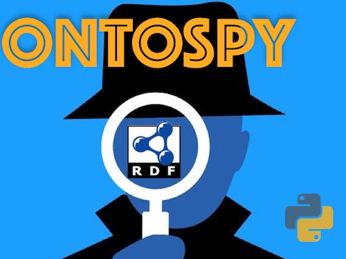
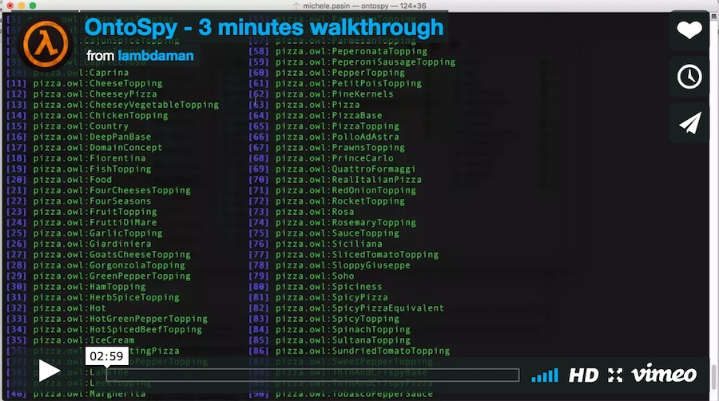

## Welcome to Ontospy's documentation!

Ontospy is a lightweight Python library and command line tool for working with vocabularies encoded in the [RDF](https://en.wikipedia.org/wiki/Resource_Description_Framework) family of languages.



> Note: some of this documentation is not valid anymore but I'm in the process of updating it

## Index

- [Welcome to Ontospy's documentation!](#welcome-to-ontospys-documentation)
- [Index](#index)
- [In a nutshell](#in-a-nutshell)
- [Installation](#installation)
- [Quick example](#quick-example)
- [Is Ontospy for me?](#is-ontospy-for-me)
- [Miscellaneous Tips](#miscellaneous-tips)
- [Generating ontology documentation](#generating-ontology-documentation)
- [Quick Links](#quick-links)

## In a nutshell

Ontospy can be used either as an interactive command line interface (a
[repl](https://en.wikipedia.org/wiki/Read%E2%80%93eval%E2%80%93print_loop>)) or as a Python package.

Calling the `ontospy` command from a terminal window launches a utility for scanning a knowledge model encoded in RDF (or any of its dialects e.g. RDFS, OWL or SKOS).

For example, if you pass a valid graph URI e.g.

```
ontospy scan http://purl.org/spar/frbr
```

Ontospy will extract and print out any ontology-related information contained in that graph.

Many other options are available, in particular Ontospy allows to load/save ontologies from/to a local repository so that they can be cached and quickly reloaded for inspection later on. All without leaving your terminal window!

[](https://vimeo.com/169707591)

## Installation

Prerequisites:

-   Python (3.x)
-   A python package manager: [setuptools](https://pypi.python.org/pypi/setuptools) or [pip](https://pip.pypa.io/en/stable/installing/).

Once you have a package manager installed, get Ontospy from the Python Package Index:

`easy_install ontospy` or `pip install ontospy`

The python library, its dependencies and all of its command-line executables will be installed.

**Upgrading**

If you’re upgrading from an older version, make sure you use the -U flag:

```
pip install ontospy -U
```

## Quick example

If used as a Python package, the basic workflow is the following: load a graph by instantiating the `Ontospy` class with a file containing RDFS, OWL or SKOS definitions; you get back an object that lets you interrogate the ontology. That's all!

Let's take a look at the [Friend Of A Friend](http://semanticweb.org/wiki/FOAF) vocabulary.

    In [1]: import ontospy
    INFO:rdflib:RDFLib Version: 4.2.0

    In [2]: model = ontospy.Ontospy("http://xmlns.com/foaf/0.1/")
    ----------
    Loaded 631 triples from <http://xmlns.com/foaf/0.1/>
    started scanning...
    ----------
    Ontologies found...: 1
    Classes found......: 14
    Properties found...: 67
    Annotation.........: 7
    Datatype...........: 26
    Object.............: 34
    SKOS Concepts......: 0
    ----------

    In [3]: model.classes
    Out[3]:
    [<Class *http://www.w3.org/2003/01/geo/wgs84_pos#SpatialThing*>,
     <Class *http://xmlns.com/foaf/0.1/Agent*>,
     <Class *http://xmlns.com/foaf/0.1/Document*>,
     <Class *http://xmlns.com/foaf/0.1/Group*>,
     <Class *http://xmlns.com/foaf/0.1/Image*>,
     <Class *http://xmlns.com/foaf/0.1/LabelProperty*>,
     <Class *http://xmlns.com/foaf/0.1/OnlineAccount*>,
     <Class *http://xmlns.com/foaf/0.1/OnlineChatAccount*>,
     <Class *http://xmlns.com/foaf/0.1/OnlineEcommerceAccount*>,
     <Class *http://xmlns.com/foaf/0.1/OnlineGamingAccount*>,
     <Class *http://xmlns.com/foaf/0.1/Organization*>,
     <Class *http://xmlns.com/foaf/0.1/Person*>,
     <Class *http://xmlns.com/foaf/0.1/PersonalProfileDocument*>,
     <Class *http://xmlns.com/foaf/0.1/Project*>]

    In [4]: model.properties
    Out[4]:
    [<Property *http://xmlns.com/foaf/0.1/account*>,
     <Property *http://xmlns.com/foaf/0.1/accountName*>,
     <Property *http://xmlns.com/foaf/0.1/accountServiceHomepage*>,
     <Property *http://xmlns.com/foaf/0.1/age*>,
     <Property *http://xmlns.com/foaf/0.1/aimChatID*>,
     <Property *http://xmlns.com/foaf/0.1/based_near*>,
     <Property *http://xmlns.com/foaf/0.1/birthday*>,
     <Property *http://xmlns.com/foaf/0.1/currentProject*>,
     <Property *http://xmlns.com/foaf/0.1/depiction*>,
    	### etc....
    	]

    In [5]: model.printClassTree()
    [1]    http://www.w3.org/2003/01/geo/wgs84_pos#SpatialThing
    [12]   ----_file_:Person
    [2]    _file_:Agent
    [4]    ----_file_:Group
    [11]   ----_file_:Organization
    [12]   ----_file_:Person
    [3]    _file_:Document
    [5]    ----_file_:Image
    [13]   ----_file_:PersonalProfileDocument
    [6]    _file_:LabelProperty
    [7]    _file_:OnlineAccount
    [8]    ----_file_:OnlineChatAccount
    [9]    ----_file_:OnlineEcommerceAccount
    [10]   ----_file_:OnlineGamingAccount
    [14]   _file_:Project


    In [6]: model.toplayer
    Out[6]:
    [<Class *http://www.w3.org/2003/01/geo/wgs84_pos#SpatialThing*>,
     <Class *http://xmlns.com/foaf/0.1/Agent*>,
     <Class *http://xmlns.com/foaf/0.1/Document*>,
     <Class *http://xmlns.com/foaf/0.1/LabelProperty*>,
     <Class *http://xmlns.com/foaf/0.1/OnlineAccount*>,
     <Class *http://xmlns.com/foaf/0.1/Project*>]

    In [7]: model.getClass("document")
    Out[7]:
    [<Class *http://xmlns.com/foaf/0.1/Document*>,
     <Class *http://xmlns.com/foaf/0.1/PersonalProfileDocument*>]

    In [8]: a_class = _[0]

    In [9]: print(a_class.serialize())
    @prefix ns1: <http://www.w3.org/2002/07/owl#> .
    @prefix ns2: <http://www.w3.org/2003/06/sw-vocab-status/ns#> .
    @prefix rdf: <http://www.w3.org/1999/02/22-rdf-syntax-ns#> .
    @prefix rdfs: <http://www.w3.org/2000/01/rdf-schema#> .
    @prefix xml: <http://www.w3.org/XML/1998/namespace> .
    @prefix xsd: <http://www.w3.org/2001/XMLSchema#> .

    <http://xmlns.com/foaf/0.1/Document> a rdfs:Class,
            ns1:Class ;
        rdfs:label "Document" ;
        rdfs:comment "A document." ;
        rdfs:isDefinedBy <http://xmlns.com/foaf/0.1/> ;
        ns1:disjointWith <http://xmlns.com/foaf/0.1/Organization>,
            <http://xmlns.com/foaf/0.1/Project> ;
        ns1:equivalentClass <http://schema.org/CreativeWork> ;
        ns2:term_status "stable" .


    In [10]: a_class.parents()
    Out[10]: []

    In [11]: a_class.children()
    Out[11]:
    [<Class *http://xmlns.com/foaf/0.1/Image*>,
     <Class *http://xmlns.com/foaf/0.1/PersonalProfileDocument*>]

## Is Ontospy for me?

Here are some reasons why you should use it:

-   You are developing a Python application that needs to extract schema information from an RDF, SKOS or OWL vocabulary.
-   You have a bunch of RDF vocabularies you regularly need to interrogate, but do not want to load a full-blown ontology editor like Protege.
-   You need to quickly generate documentation for an ontology, either as simple html pages or via some more elaborate interactive visualization (UPDATE: check out the [OntoDocs](https://github.com/lambdamusic/Ontodocs) library for this!).
-   You love the command line and would never leave it no matter what.

> note: Ontospy does not offer any ontology-editing features, nor it can be used to interrogate a triplestore.

## Miscellaneous Tips

If you are using El Capitan your installation line probably will look like this

    > sudo pip install ontospy -U --user python

This is due to the new [System Integrity Protection](https://support.apple.com/en-us/HT204899), more info on this [stackoverflow post](http://stackoverflow.com/questions/33234665/upgrading-setuptools-on-osx-el-capitan)

## Generating ontology documentation

Ontospy can be used to generate HTML ontology documentation pretty easily.

This functionality relies on another library called [OntoDocs](https://github.com/lambdamusic/Ontodocs) but I'm currenlty working on bringing it back within Ontospy as an add-on, essentially because it's easier to maintain.

**Examples**

-   [Schema.org](http://www.michelepasin.org/support/ontospy-examples/schema_org_topbraidttl/index.html) documentation.
-   [FOAF](http://www.michelepasin.org/support/ontospy-examples/foafrdf/index.html) documentation.

That's the kind of documentation OntoDocs can generate out-of-the-box. For even more examples, [take a look at this page](http://www.michelepasin.org/support/ontospy-examples/index.html).

**Installation**

```
pip install ontodocs -U
```

Ontodocs allows to generate documentation for an RDF vocabulary, using visualization algorithms that create simple HTML pages, Markdown files, or more complex javascript interactive charts based on D3.js.

```
> ontospy viz -h
Usage: ontospy viz [OPTIONS] [SOURCE]...

  Visualize a model using ontodocs library

Options:
  -o, --outputpath TEXT  Output path (default: home folder).
  -t, --title TEXT       Title for the visualization (default=graph uri).
  --theme TEXT           CSS Theme for the html-complex visualization
                         (random=use a random theme).
  --showthemes           Show the available CSS theme choices.
  -h, --help             Show this message and exit.
```

The library is not really meant to be used programmatically, but I'm sure there are a few constructs in there which can be reused.

In a nutshell, all visualizations inherit from a [VizFactory](https://github.com/lambdamusic/Ontodocs/blob/master/ontodocs/core/viz_factory.py) class that abstracts away the most common operations involved in rendering a dataviz.

This is how you would invoke a visualization from a script:

```
import ontospy
from ontodocs.viz.viz_html_single import *

g = ontospy.Ontospy("http://cohere.open.ac.uk/ontology/cohere.owl#")

v = HTMLVisualizer(g) # => instantiate the visualization object
v.build() # => render visualization. You can pass an 'output_path' parameter too
v.preview() # => open in browser

```

## Quick Links

-   Github: [https://github.com/lambdamusic/ontospy](https://github.com/lambdamusic/ontospy)
-   CheeseShop: [https://pypi.python.org/pypi/ontospy](https://pypi.python.org/pypi/ontospy)
-   Homepage: [http://www.michelepasin.org/projects/ontospy](http://www.michelepasin.org/projects/ontospy)

Also:

-   Video: [https://vimeo.com/169707591](https://vimeo.com/169707591)

Issues or questions?

-   Then head over to the [issues](https://github.com/lambdamusic/Ontospy/issues) page.

What's changed recently?

-   Please have a look at the [Changelog](pages/changelog.html)
